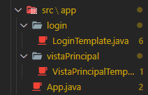

# Interfaz Gráfica en Java

Curso propuesto por el grupo de trabajo Semana de Ingenio y Diseño (**SID**) de la Universidad Distrital Francisco Jose de Caldas.

## Monitor

**Cristian Felipe Patiño Cáceres** - Estudiante de Ingeniería de Sistemas de la Universidad Distrital Francisco Jose de Caldas

# Clase 3

## Objetivos

- Reconocer la forma de Añadir modularidad a nuestro código en las clases **Template** separando la agregación de objetos gráficos.
- Optimizar el código con el uso de un servicio que encapsula el funcionamiento para la creación de objetos gráficos.
- Optimizar los recursos de nuestra aplicación con el uso de un servicio que administre los objetos que pueden ser utilizados en diferentes clases.

# Antes de comenzar

En nuestras anteriores clases hemos creado una clase **VistaPrincipalTemplate** y otra clase **LoginTemplate** cada una en su respectivo paquete como podemos ver a continuación:

  
  
Clases UI en sus respectivos paquetes

Ahora y por motivos de modularidad vamos a crear un paquete llamado **client** y allí vamos a dejar nuestros paquetes de las clases UI que hemos creado.
