# Interfaz Gráfica en Java

Curso propuesto por el grupo de trabajo Semana de Ingenio y Diseño (**SID**) de la Universidad Distrital Francisco Jose de Caldas.

## Monitor

**Cristian Felipe Patiño Cáceres** - Estudiante de Ingeniería de Sistemas de la Universidad Distrital Francisco Jose de Caldas

# Clase 4

## Objetivos

- Reconocer la forma de Añadir modularidad a nuestro código en las clases **Template** separando la creación de objetos gráficos.
- Optimizar el código con el uso de un servicio que encapsula el funcionamiento de la construcción de objetos gráficos.
- Optimizar los recursos de nuestra aplicación con el uso de un servicio que administre los objetos que pueden ser utilizados en diferentes clases.

# Antes de comenzar

En nuestras anteriores clases hemos creado una clase **VistaPrincipalTemplate** y otra clase **LoginTemplate** cada una en su respectivo paquete como podemos ver a continuación:

<div align="center">
  
  <p>Clases UI en sus respectivos paquetes</p>
</div>

Ahora por motivos de modularidad vamos a crear un paquete llamado **client** y allí vamos a dejar nuestros paquetes de las clases UI que hemos creado. Nuestro archivo de ejecución App.java sigue estando ubicado en el paquete principal **app**.

<div align="center">
  
  <p>Creación de paquete client que contiene nuestros paquetes creados previamente</p>
</div>

Recordando un poco nuestro recorrido, en nuestra primera clase habíamos creado nuestra clase **VistaPrincipalTemplate** que hasta el momento esta vacía:

<div align="center">
  
  <p>Vista principal creada en primera clase.</p>
</div>

También creamos nuestra clase **LoginTemplate** y el resultado de nuestra anterior clase fue el siguiente:

<div align="center">
  
  <p>Login de usuario resultado anterior clase.</p>
</div>

# Modularización y optimización

En esta clase vamos a ver 3 temas principales que nos ayudaran para que el código quer realicemos al construir interfaces gráficas de usuario sea mucho mas ordenado, mantenible y mas sencillo de hacer. Los temas principales son:

* **Modularización de código**
* **Optimización de código**
* **Optimización de recursos**

# Modularización de código

Ya hemos creado nuestro login de usuario que se ve muy bien, sin embargo si en algún momento queremos cambiar una configuración en alguno de los objetos gráficos creados va ser algo complicado encontrar dicho objeto. Aunque nuestro código tiene algo de organización con la separación de la creación de cada uno de nuestros objetos gráficos, nuestro constructor tiene una gran cantidad de lineas de código.

<div align="center">
  
  <p>Separación de creación de objetos gráficos dentro del constructor.</p>
</div>


Una buena idea para organizar nuestro código seria el uso de métodos que nos ayuden separar la creación de objetos gráficos de acuerdo a sus tipos. Por ejemplo podemos crear un método llamado **crearJPanels()** e insertar la creación de todos nuestros objetos tipo JPanel  allí.

```javascript
public void crearJPanels(){

    pIzquierda = new JPanel();
    pIzquierda.setSize(600, 500);
    pIzquierda.setLocation(0, 0);
    pIzquierda.setBackground(Color.white);
    pIzquierda.setLayout(null);
    this.add(pIzquierda);

    pDerecha = new JPanel();
    pDerecha.setSize(400, 500);
    pDerecha.setLocation(600, 0);
    pDerecha.setBackground(Color.white);
    pDerecha.setLayout(null);
    this.add(pDerecha);
}
```

Ahora por ejemplo podemos crear otro método llamado **crearJTextfields()** e insertar la creación de los objetos gráficos tipo JTextField.

```javascript
public void crearJTextFields(){

    tNombreUsuario = new JTextField("Nombre Usuario");
    tNombreUsuario.setSize(260, 40);
    tNombreUsuario.setLocation((pDerecha.getWidth() - tNombreUsuario.getWidth()) / 2, 130);
    tNombreUsuario.setForeground(colorAzul);
    tNombreUsuario.setBackground(Color.WHITE);
    tNombreUsuario.setCaretColor(colorGrisOscuro);
    tNombreUsuario.setBorder(border);
    tNombreUsuario.setHorizontalAlignment(SwingConstants.CENTER);
    pDerecha.add(tNombreUsuario);
}
```

otros métodos de creación necesarios para nuestra clase son:

```javascript
public void crearObjetosDecoradores(){
    ...
}
```
```javascript
public void crearJButtons(){
    ...
}
```
```javascript
public void crearJLabels(){
    ...
}
```
```javascript
public void crearJPasswordFields(){
    ...
}
```
```javascript
public void crearJComboBoxes(){
    ...
}
```
```javascript
public void crearJCheckBoxes(){
    ... // También se crea el objeto ButtonGroup aquí al ser un objeto auxiliar 
}
```

Hay que aclarar varias cosas aquí:

## ¿Por que es posible hacer esta modularización?

Como recordaremos, la declaración de nuestros objetos gráficos y objetos decoradores la realizamos de forma global al inicio de nuestra clase, haciendo de estos objetos atributos de nuestra clase. 

<div align="center">
  
  <p>Atributos de la clase LoginTemplate.</p>
</div>

Esto permite que cualquier entorno interno (Método) dentro de nuestra clase pueda conocer cada uno de estos objetos gráficos. Por ejemplo si en un caso hipotético se realizara la declaración de los paneles dentro del método **crearJPanels()** estos objetos gráficos solo existirían dentro de ese método y cuando se quiera agregar el JTextField creado en el método **crearJTextFields()** al panel **pDerecha** saltara un error por que para ese método el panel pDerecha no existe.

<div align="center">
  
  <p>Error al crear los paneles dentro de un solo entorno.</p>
</div>

Es por esta razón que la declaración se hace de forma global y como atributos de nuestra clase. Aunque no todos nuestros objetos gráficos o decoradores tienen que ser atributos, por ejemplo un **ButtonGroup** que solo afecta a los objetos **JCheckBox** se puede crear como variable en el método **crearJCheckBoxes()** y como probablemente este objeto no se necesite para nada más en el futuro se podría tratar como una variable dentro de este método. El programador debe elegir cual de los objetos gráficos y objetos Decoradores necesita declarar globalmente o como variable dentro de un entorno.  Sin embargo nunca se sabe cuando se podría necesitar alguno de estos en otro contexto así que como preferencia personal es preferible mantener todos los objetos gráficos y los objetos Decoradores como atributos.

## Ejecución de métodos de creación desde el constructor

Si ya hemos pasado todos nuestros objetos gráficos y objetos Decoradores a sus respectivos métodos nuestro constructor se vera ahora así: 

<div align="center">
  
  <p>Constructor después de hacer los métodos de creación.</p>
</div>

Se puede notar que lo único que esta dentro de nuestro constructor es la configuración de nuestra ventana. Si corremos nuestra aplicación notamos que no se verá nada. 

<div align="center">
  
  <p>Login de usuario después de hacer los métodos de creación.</p>
</div>

Esto es por que tenemos que llamar desde el constructor nuestros métodos de creación. Por ejemplo al llamar estos 4 métodos de creación : 

<div align="center">
  
  <p>Constructor después de hacer los métodos de creación.</p>
</div>

nuestra aplicación se vera así. 

<div align="center">
  
  <p>Login de usuario con la llamada de algunos métodos de creación.</p>
</div>

Entonces es necesario llamar a todos estos métodos dentro del constructor.

## Organización en el eje Z y de métodos de creación

Tenemos que tener en cuenta la organización de los objetos con respecto al eje z como se discutió en la clase anterior. Eso quiere decir que hay que tener cuidado en el **orden en que vamos a llamar los métodos**. Por ejemplo:
* Si llamamos el método **crearJTextFields()** antes del método **crearJPanels()** ocurrirá un error por que no es posible añadir un objeto gráfico a un panel que aun no se ha creado.

<div align="center">
  
  <p>Error por que no se ha creado los JPanel previamente.</p>
</div>

* Si llamamos el método **crearObjetosDecoradores()** después de llamar cualquier otro método que crea objetos gráficos en los que se incorpora objetos decoradores ocurrirá un error.

<div align="center">
  
  <p>Error por que no se ha creado los objetos decoradores previamente.</p>
</div>

* Si llamamos el método **crearJLabels()** antes de llamar el método de **crearJButtons()** el fondo del login tapara los botones en el panel **pIzquierda**.

<div align="center">
  
  <p>Los botones del panel pIzquierda no se ven por que están tapados por el fondo.</p>
</div>

Entonces es necesario que el programador tenga en cuenta la organización en la llamada de los métodos de creación. Una organización apropiada para nuestro caso puede ser:

<div align="center">
  
  <p>Organización correcta en la llamada de los métodos de creación.</p>
</div>

## Ventajas de este enfoque

Nuestro código esta más organizado, cuando queramos cambiar la configuración de algún botón ya no tardaremos en encontrarlo dentro del constructor, ahora podremos ir a nuestro método encargado de la creación de botones y cambiar lo que consideremos necesario. 

Ademas para poder concentrarnos aun mejor en una parte de nuestro código, el editor de texto nos da la posibilidad de minimizar el código por métodos y así concentrarnos en una sola parte de este.

<div align="center">
  
  <p>Minimización de código por métodos.</p>
</div>


# Optimización de código

Ya aprendimos la forma de como crear nuestros objetos gráficos para mostrarlos en pantalla y como crear objetos decoradores para incorporarlos en ellos. Sin embargo son muchas las configuraciones que hay que aprender y es mucho el código que se extiende en nuestras clases para la creación de estos objetos gráficos. Si nuestra interfaz Gráfica de usuario tiene 20 botones por ejemplo debemos realizar el proceso de creación 20 veces y no solo gasta tiempo sino que requiere la memorización de muchas configuraciones y nuestro codigo se hará más y más largo.

Una alternativa a esto es la creación de una clase que se encargue de proporcionarnos un servicio, este servicio sera el de la construcción de los objetos gráficos de forma genérica de tal forma que para crear uno de estos objetos solo tengamos que llamar al servicio y este nos lo retorne. Vamos a explicar de que se trata.

**Nota**: *Antes de continuar vamos a ver que se tratara con un tema relacionado a los servicios, esta clase no tiene como finalidad explicar que son los servicios asi que solo se dará una breve explicación de ellos a medida que se avanza, sin embargo en clases posteriores nos enfocaremos en su concepto y finalidad.*

Dentro de nuestro proyecto en el paquete raíz **app** ahora crearemos un nuevo paquete al cual llamaremos **services** y dentro crearemos una clase llamada **ObjGraficosService**.

<div align="center">
  
  <p>Creación de paquete services y servicio para la creación de objetos gráficos.</p>
</div>

Cabe resaltar que los servicios que creemos en nuestro proyecto tendrán el nombre de la clase (arbitrario) seguido de la palabra **Service**.

Nuestra clase **ObjGraficosService** se encargará de la construcción de los objetos gráficos a traves de métodos que podremos usar desde cualquier clase **Template** que tengamos en nuestro proyecto. Para garantizar lo anterior dicho, debemos crear un mecanismo para que cualquier clase dentro de la aplicación pueda llamar al objeto y pueda usar sus métodos pero a su vez **este objeto solo se cree una vez para todas las clases.**

## Singleton 

Es importante que este servicio se cree una sola vez en memoria. Esto por que va a ser un objeto usado en todas las clases **template** que creemos y si nuestro proyecto tiene 30 clases por ejemplo y si cada una de estas crea un objeto de este servicio estamos creando 29 objetos de más innecesarios que consumirán recursos. 

Lo primero que haremos es crear su constructor pero su **tipo de acceso será privado**:

```javascript
private ObjGraficosService(){
        
}
```
Esto garantiza que no se pueda ejemplificar el objeto desde ninguna otra clase (es decir no se puede hacer  **.. = new ObjGraficosService()**).

Dentro de la misma clase **ObjGraficosService** vamos a crear un objeto **static** de tipo de la misma clase:
```javascript
static private ObjGraficosService servicio;
```

Ahora realizaremos un método **static** para crear el objeto de este servicio y retornarlo a quien lo necesite.

```javascript
public static ObjGraficosService getService(){
    if(servicio == null){
        servicio = new ObjGraficosService();
    }
    return servicio;
}
```
Se pueden notar varias cosas del método anterior:
* La palabra clave **static** asegura que el método dentro de este servicio pueda ser llamado desde cualquier otra clase sin necesidad de ejemplificar el objeto anteriormente. 
* En el atributo de la clase se pone el **static** también por que las variables que se trabajen dentro de un método **static** deben serlo también.
* El método retorna un objeto de la propia clase. Esto quiere decir que es la misma clase la única encargada de su propia ejemplificación.
* El **if** asegura la ejemplificación única del objeto del servicio, si este es nulo lo ejemplifica y lo retorna, cosa que ocurrirá la primera vez que se llame al método. Pero en las posteriores llamadas al método, como el objeto ya fue ejemplificado previamente ya no entrara al if y lo retornara simplemente.
* Este método que acabamos de realizar es conocido como **Patron Singleton** y hace parte de los patrones de diseño.

Ahora en nuestra Clase **LoginTemplate** podemos obtener el objeto del servicio llamando a este método de la siguiente manera:
* Primero se importa el servicio
```javascript
import app.services.ObjGraficosService;
```
* Se declara el objeto:
```javascript
private ObjGraficosService sObjGraficos;
```
La declaración de los objetos de los servicios inician con una s en minúscula seguido de la variable (objeto) arbitraria.

* Se obtiene su ejemplificacíon dentro del constructor (Esta sera la primera linea de código en el constructor).
```javascript
sObjGraficos = ObjGraficosService.getService();
```

Como esta es la primera clase que llama a este método el objeto del servicio se ejemplificará, pero mas adelante cuando otra clase **template** realice el mismo proceso obtendrá el objeto que ya se había ejemplificado previamente.

Ahora veremos un acercamiento de como serán los métodos de que encapsulan la construcción genérica de los objetos gráficos dentro del servicio:

## JPanel 

Dentro de nuestro servicio podemos empezar con la construcción de paneles para esto declaramos un objeto gráfico tipo JPanel y lo configuramos dentro de un método al cual llamaremos **construirJPanel**, este recibirá por parámetros las cosas necesarias para su correcta construcción.

```javascript
private JPanel panel;
```
```javascript
public JPanel construirJPanel(int x, int y, int ancho, int alto, Color colorFondo, Border borde){
    panel = new JPanel(); 
    panel.setSize(ancho, alto);
    panel.setLocation(x, y);
    panel.setLayout(null);
    panel.setBackground(colorFondo);
    panel.setBorder(borde);
    return panel;
}
```
Podemos observar que este método retorna un objeto tipo JPanel y recibe por parámetros: 
* **Posición en x**: recibe un entero (int).
* **Posición en y**: recibe un entero (int).
* **Ancho**: recibe un entero (int).
* **Alto**: recibe un entero (int).
* **Color de Fondo**: recibe un objeto decorador tipo Color.
* **Borde**: recibe un objeto decorador tipo Border.

Adentro se encarga de la **ejemplificación y configuración del objeto gráfico para después retornarlo** por lo que realiza 2 de las 4 etapas de la creación de un objeto gráfico, estas dos etapas las podemos generalizar en un termino que es la **construcción del objeto**, esta es la razón de su nombre.

También se puede notar que hay configuraciones por defecto como la anulación del Layout Manager para ser posicionado por nosotros mismos.

Ahora desde nuestra clase **LoginTemplate** podemos llamar a este método buscando un panel dentro del método encargado de la creación de paneles y poner:

```javascript
pIzquierda = sObjGraficos.construirJPanel(0, 0, 600, 500, Color.WHITE, null);
this.add(pIzquierda);
```

Note varias cosas importantes:
* La creación de un JPanel se redujo de 6 lineas de código a solo 2.
<div align="center">
  
  <p>Comparación de creación de un JPanel de forma habitual o con el servicio.</p>
</div>

* Nuestros nombres en los parámetros son muy intuitivos esto quiere decir que ya no tenemos que recordar el nombre exacto de cada método de configuración en el futuro si no que ya sabemos que debemos enviar.
<div align="center">
  
  <p>Parámetros intuitivos en la creación de nuestros objetos gráficos.</p>
</div>

* Si un objeto gráfico no contiene alguna propiedad que se pide en el método como es el ejemplo de un borde para nuestro panel simplemente se envía el argumento como **null**. 

<div align="center">
  
  <p>Argumento de borde enviado como null ya que no se requiere en el panel.</p>
</div>

* Si considera que el código ocupa mucho espacio de forma horizontal puede acomodarlo a su preferencia:

<div align="center">
  
  <p>Otras formas de formatos del código.</p>
</div>

Debemos hacer el mismo proceso con nuestro otro panel **pDerecha**.

## JButton

Vamos a ver como se realizaría el método para la construcción genérica de un botón. Y mostramos este método en especifico por que es el método de construcción que necesita más parámetros para construir

```javascript
private JButton button;
```
```javascript
public JButton construirJButton(
    String texto, int x, int y, int ancho, int alto, Cursor cursor, ImageIcon imagen, Font fuente, 
    Color colorFondo, Color colorFuente, Border borde, String direccion, boolean esSolido
){        
    button= new JButton(texto);
    button.setSize(ancho, alto);
    button.setLocation(x, y);
    button.setFocusable(false);
    button.setCursor(cursor);
    button.setFont(fuente);
    button.setBackground(colorFondo);
    button.setForeground(colorFuente);
    button.setIcon(imagen);
    button.setBorder(borde);
    button.setContentAreaFilled(esSolido);
    switch(direccion){
        case "l":
            button.setHorizontalAlignment(SwingConstants.LEFT);
            break;
        case "r":
            button.setHorizontalAlignment(SwingConstants.RIGHT);
            break;    
        default:
            break;
    }
    return button;
}
```

Podemos observar que el método recibe por parámetros lo siguiente: 

* **texto del botón:** recibe un String.
* **posición x:** recibe un entero (int).
* **posición y:** recibe un entero (int).
* **ancho:** recibe un entero (int).
* **alto:** recibe un entero (int).
* **cursor:** recibe un objeto decorador tipo Cursor. 
* **imagen:** recibe un objeto decorador tipo ImageIcon. 
* **fuente:** recibe un objeto decorador tipo Font.
* **color de Fondo**:  recibe un objeto decorador tipo Color.
* **color de Fuente:**  recibe un objeto decorador tipo Color.
* **borde:** recibe un objeto decorador tipo Border.
* **dirección:** recibe un String que representa la posición horizontal de lo que contenga el botón. Esta puede ser:
    * "l" (left): si se desea dejar el contenido en la parte izquierda.
    * "c" (center): si se desea dejar el contenido en el centro.
    * "r" (right): si se desea dejar el contenido en la parte derecha.
* **¿es Solido?:** recibe un booleano, y pregunta si se quiere crear un botón solido o transparente. Si se manda en True dejara las propiedades de contenido de Java, si se pasa como False le quitara esas propiedades dejándolo transparente.

Ahora desde nuestra clase **LoginTemplate** podemos llamar a este método para la construcción de los botones, para lo que vamos a entrar al método encargado de la creación de los botones. A continuación se muestran 2 botones diferentes para ver algunas particularidades:
```javascript
bEntrar = sObjGraficos.construirJButton(
    "Entrar", (pDerecha.getWidth() - 230) / 2, 330, 
    250, 45, cMano, null, null, colorAzul, 
    Color.WHITE, null, "c", true
);
pDerecha.add(bEntrar);

iDimAux = new ImageIcon(
    iCerrar.getImage().getScaledInstance(30, 30, Image.SCALE_AREA_AVERAGING)
);

bCerrar = sObjGraficos.construirJButton(
    null, 350, 10, 45, 30, cMano, iDimAux, null, 
    null, null, null, "c", false
);
pDerecha.add(bCerrar);
```

Podemos observar lo siguiente en la creación de los dos anteriores botones:
* **Primer botón:**
    * Este botón contiene texto asi que se enviá en forma de comillas " ".
    * Va posicionado en la mitad del panel por lo que se envía el calculo, solo que ahora enviando el ancho del botón como numero directamente. 
    * Tiene incorporado un cursor y se envía como argumento.
    * Tiene color de fondo y color de fuente por lo que se envía como argumento.
    * No contiene ni un borde ni una imagen ni una fuente asi que se envía como argumentos null.
    * Su contenido esta centrado por lo que se envía una "c" como argumento.
    * Como este botón tiene color de fondo entonces es un botón solido y se envía True.
* **Segundo botón:**
    * Este botón no tiene texto asi que se enviá null como argumento.
    * Este botón contiene una imagen, pero esta debe ser previamente redimensionada para que al enviarse quede como queremos. 
    * Tiene incorporado un cursor y se envía como argumento.
    * No contiene ningún color asi que se envía como argumentos null.
    * No contiene ni un borde ni una fuente asi que se envía como argumentos null.
    * Su contenido esta centrado por lo que se envía una "c" como argumento.
    * Como este botón no tiene color de fondo entonces es un botón transparente y se envía un False para conseguir esto.

Debemos hacer uso del servicio para crear los otros botones en nuestra clase **LoginTemplate**. Si intentamos correr nuestra aplicación podemos verificar que corre perfectamente y se ve igual a como la teníamos, esto quiere decir que el servicio esta funcionando:

<div align="center">
  
  <p>Interfaz gráfica funcionando correctamente con la incorporación del servicio ObjGraficosService.</p>
</div>

El resto de métodos de nuestro servicio esta contenido dentro de este repositorio, puede observar todo el código  entrando a la carpeta **Clase4** luego a la carpeta **src/app** seguido de la carpeta **services** y entrando a la clase **objGraficosservice.java**. Allí usted podrá copiar los métodos que hacen falta y empezar a implementarlos desde la clase **LoginTemplate** para la optimización del código. 
     
<div align="center">
  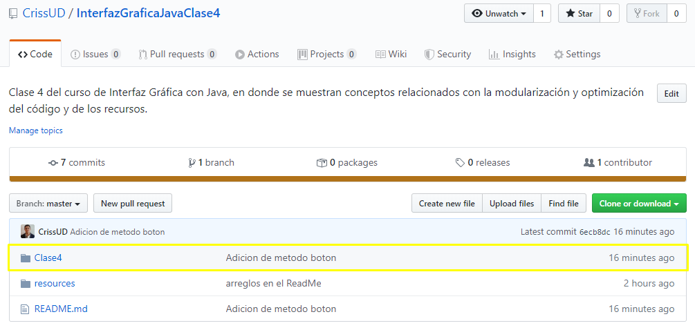
  <p>Carpeta Clase4 dentro del repositorio.</p>
</div>

<div align="center">
  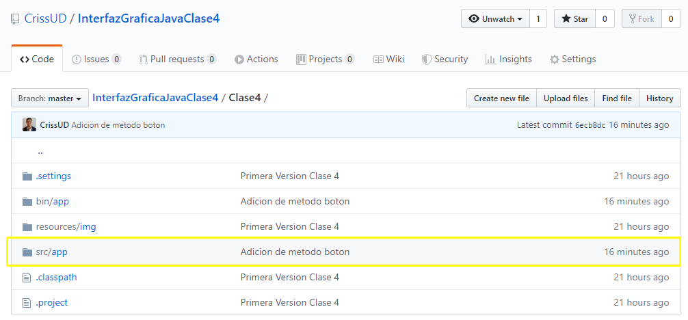
  <p>Carpeta src/app dentro del repositorio.</p>
</div>

<div align="center">
  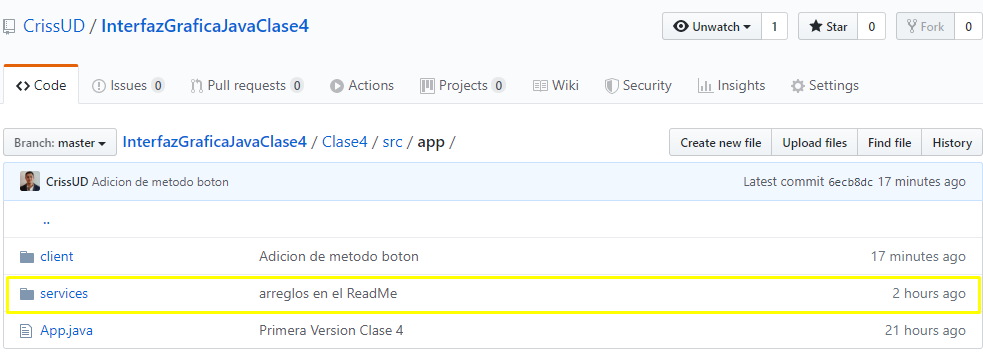
  <p>Carpeta services dentro del repositorio.</p>
</div>

<div align="center">
  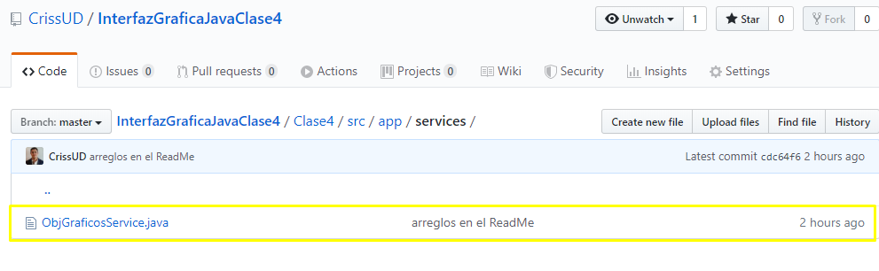
  <p>Clase ObjGraficosService.java dentro del repositorio.</p>
</div>

<div align="center">
  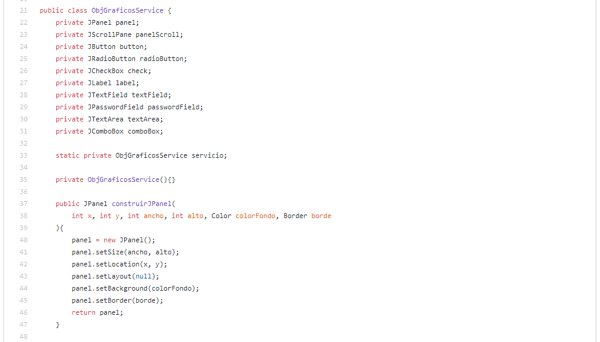
  <p>Código del servicio dentro del repositorio.</p>
</div>

Una vez haya copiado todos los métodos de construcción en el servicio, este estará listo para usarse en todas nuestras clases **template** que creemos posteriormente. Este servicio podrá usarse también en todos sus proyectos frontend para hacer más fácil la creación de objetos gráficos. Recuerde que cuando tenga el servicio completo podrá usarlo en la clase **loginTemplate** para la construcción de todos los objetos gráficos y probar que todo esta bien corriendo la aplicación.


# Optimización de recursos

Si ya hemos llegado hasta aquí hemos realizado una moduralización de nuestro código y ademas  una optimización de este. Pero aun podemos dar un paso más, vamos a ver la optimización de recursos. Esto intenta resolver la creación desproporcionada de objetos que estaremos creando en nuestras clases UI. 

Tenemos que hallar una forma de controlar la creación de objetos que muy posiblemente usemos en varias clases. Por ejemplo los objetos decoradores son muy propensos a ser utilizados en diferentes clases. Es muy posible que el cursor que creamos para pasar sobre los botones lo usemos también en otras clases que tengan botones. El color Azul muy posiblemente lo usemos en nuestra clase **VistaPrincipalTemplate** y en muchas otras más. 

Imaginen que por cada clase **template** que tengamos en un proyecto vamos a crear un objeto para el cursor o varios objetos para usar las mismas fuentes, colores, bordes o imágenes. La cantidad de recursos en memoria sería exorbitante.

Vamos a crear otro servicio llamado **RecursosService** y realizaremos el mismo mecanismo de única ejemplificación explicada previamente.

<div align="center">
  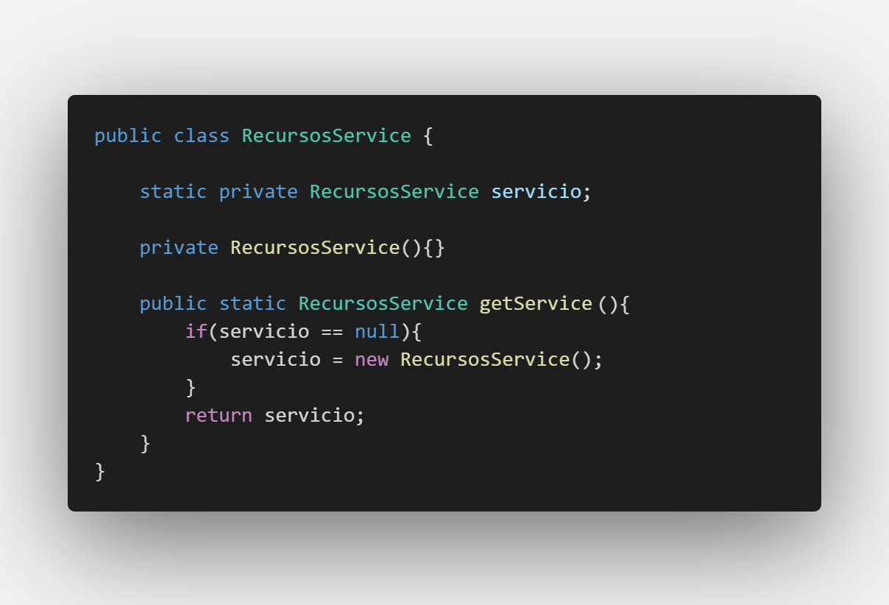
  <p>Creación de servicio Recursos.</p>
</div>

Ahora en la clase **loginTemplate** debemos igualmente obtener el objeto de este servicio:
**importación**
```javascript
import app.services.RecursosService;
```
**declaración**
```javascript
private RecursosService sRecursos;
```
**obtención de ejemplificación**
```javascript
sRecursos = RecursosService.getService();
```
Vamos a mirar que objetos decoradores se pueden usar en varias clases **template**:

* El cursor de mano para los botones seguramente se use en varias clases que tengan botones.
* Los colores también se usaran en varias partes del proyecto, es común que un proyecto entero de Interfaz Gráfica de usuario maneje una gama especifica de colores.
* Las fuentes se usaran claramente en otras clases, no todas las fuentes se usaran en todo el proyecto podrían existir unas particulares en una clase pero es bueno manejar una tipografía común en todas nuestras interfaces del proyecto.
* El borde azul en la parte inferior es probable que lo usemos en otras clases que contengan JTextField.
* La imagen de cerrar ventana se podría volver a utilizar en la Vista principal.

Ahora vamos a realizar la creación de estos objetos decoradores en el servicio (los podemos crear dentro del constructor del servicio o en un método encargado de la creación de objetos decoradores dentro del servicio) y los borraremos de nuestra clases **LoginTemplate**:

<div align="center">
  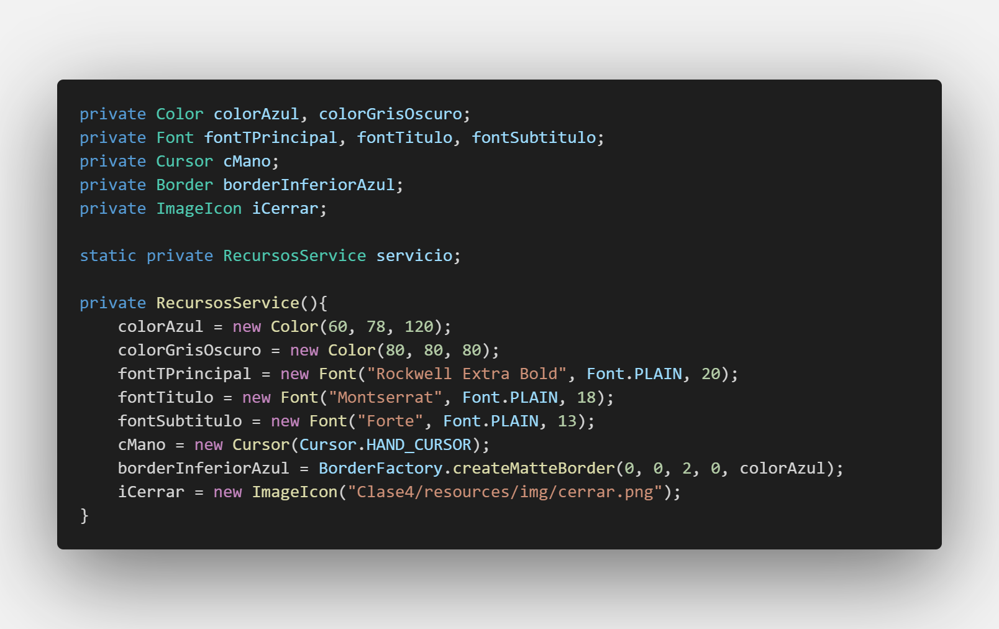
  <p>Objetos decoradores que se van a utilizar en varias partes del proyecto creados dentro del servicio.</p>
</div>

Note que el nombre de la variable **border** cambio a **borderInferiorAzul** esto ya que es muy probable que creemos más bordes en nuestro proyecto y necesitamos ser específicos con cada uno de nuestros objetos.

<div align="center">
  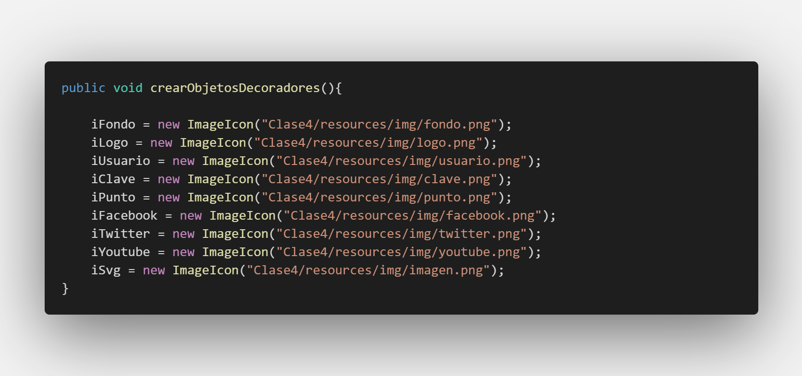
  <p>El método crearObjetosDecoradores de la clase LoginTemplate con solo los objetos decoradores necesarios unicamente en esa clase.</p>
</div>

Ahora para que cualquier clase **template** pueda obtener estos objetos decoradores a traves del servicio necesitamos crear unos métodos **get** que nos retornen estos objetos:

```javascript
public Color getColorAzul(){
    return colorAzul;
}

public Color getColorGrisOscuro(){
    return colorGrisOscuro;
}

public Font getFontTPrincipal(){
    return fontTPrincipal;
}

public Font getFontTitulo(){
    return fontTitulo;
}

public Font getFontSubtitulo(){
    return fontSubtitulo;
}

public Cursor getCMano(){
    return cMano;
}

public Border getBorderInferiorAzul(){
    return borderInferiorAzul;
}

public ImageIcon getICerrar(){
    return iCerrar;
}
```

Nuestro servicio esta listo para ser usado. Ahora desde nuestra clase **LoginTemplate** cuando necesitemos uno de estos objetos decoradores solo llamaremos al servicio seguido del método **get** que necesitemos. Mostraremos un ejemplo de esto:

<div align="center">
  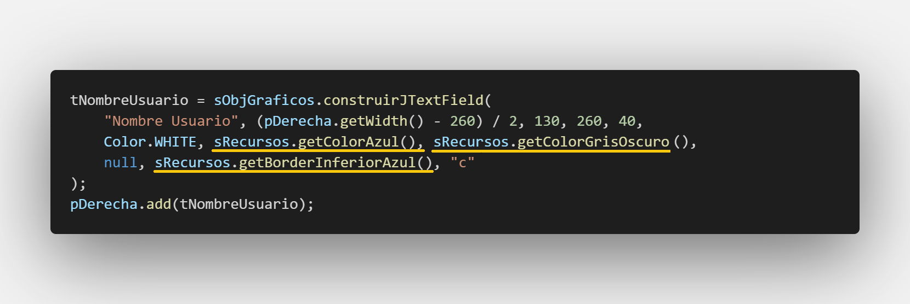
  <p>Ejemplo de implementación de servicio de Recursos para obtener objetos decoradores compartidos entre clases.</p>
</div>

Se debe hacer esto con todos los objetos que eliminamos de la clase **LoginTemplate** y correr la aplicación para verificar que esta ocurriendo todo con normalidad.

<div align="center">
  
  <p>Interfaz gráfica funcionando correctamente con la incorporación del servicio RecursosService.</p>
</div>


Ahora si por ejemplo en nuestra clase **VistaPrincipalTemplate** necesitamos utilizar alguno de estos objetos decoradores como el color Azul para dejar el fondo de la ventana con ese color ahora llamaremos al servicio para obtenerlo:

<div align="center">
  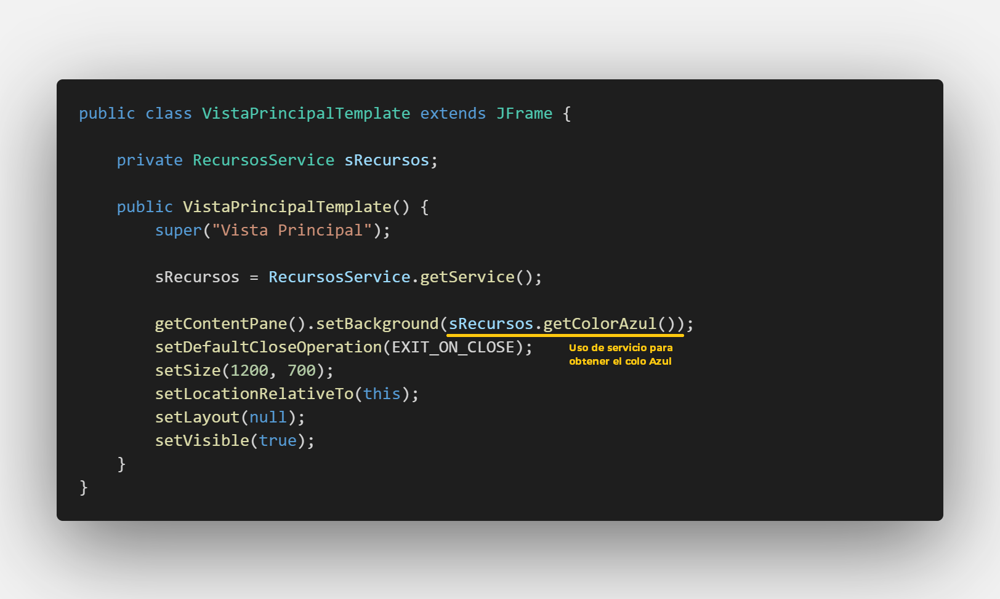
  <p>Servicio Recursos utilizado en la clase VistaPrincipalTemplate para obtener el color azul.</p>
</div>


<div align="center">
  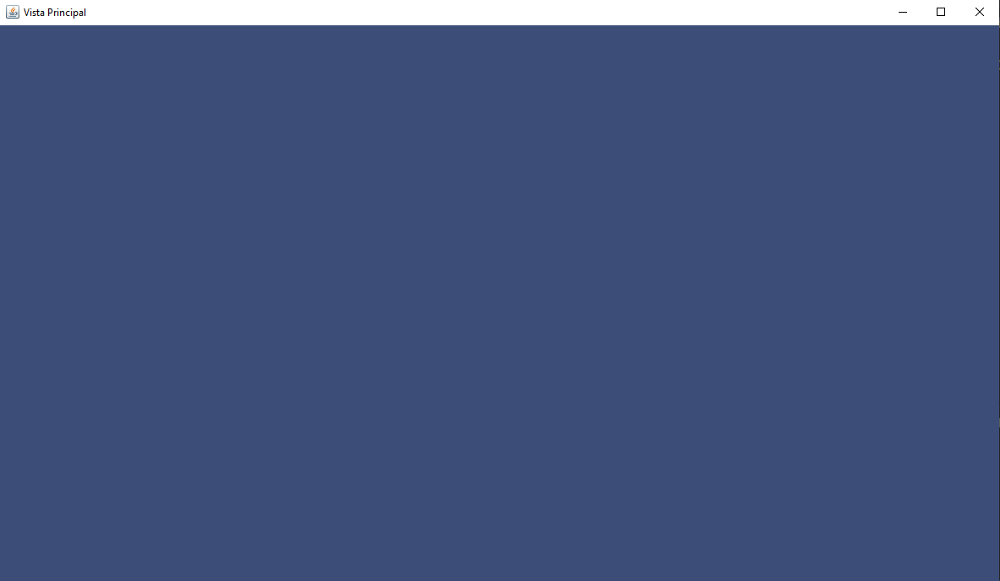
  <p>Ventana VistaPrincipalTemplate.</p>
</div>

 Aunque el objeto decorador **colorAzul** se ve reflejado en dos clases distintas solo existe una vez en memoria. De igual forma el servicio **RecursosService** solo existirá una vez en memoria sin importar en cuantas clases lo llamen.

# Resultado

Si has llegado hasta aquí **!Felicidades!** ahora no solo tienes una interfaz gráfica agradable para el usuario, también tienes un código mucho más optimizado modularizado, responsable con los recursos y mantenible.

En la siguiente clase vamos a revisar el concepto de Componente gráfico y su importancia en la creación de interfaces gráfica con proyectos grandes. También nos introduciremos a los eventos empezando con los eventos básicos de botones.

# Actividad

Implementa los servicios de creación de objetos gráficos y de recursos para agregar optimización de código y recursos en sus Login propios.  Ademas de realizar modularizacion en el código.